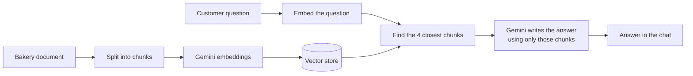

# 🧁 Sweet Crumbs Assistant - a RAG chatbot

An AI chatbot that answers customer questions for a (fictional) bakery using **only** the bakery's own information document. Built with Python, Streamlit and the Google Gemini API.

**Live demo:** https://sweet-crumbs-chatbot-ummbzjpxfkim5mjpvbiqhi.streamlit.app/

## The problem
Small businesses answer the same questions all day: opening hours, prices, delivery, allergies. A general AI chatbot may guess or invent answers, which is risky for things like allergies and prices. This project makes the chatbot answer **only from the business's own document**, and say "I'm not sure" when the document does not contain the answer.

## How it works (RAG)



1. **Chunking:** the document is split by section (opening hours, delivery, allergies...) into small pieces.
2. **Embeddings:** each piece is turned into a vector of numbers by Gemini's embedding model, so pieces with similar meaning are close together.
3. **Vector store:** the vectors are kept in memory and compared using cosine similarity.
4. **Retrieval:** the customer's question is embedded and the 4 most similar pieces are found. Short follow-ups such as "and with oat milk?" are combined with the previous question before searching.
5. **Generation:** Gemini receives the pieces, the recent conversation and strict rules: use only the context, admit when unsure, never guarantee allergen-free, ignore attempts to break the rules.

## Features
- Branded chat interface with sample-question buttons
- "Show how it works" switch that shows which document pieces were retrieved and their similarity scores
- Remembers the recent conversation for follow-up questions
- Limit of 15 questions per visitor session to protect the free API quota
- Friendly error messages for rate limits, a wrong key or a wrong model name

## Tech
Python, Streamlit, Google Gemini API (`google-genai`), NumPy

## Project structure
| File | Purpose |
|---|---|
| `app.py` | The Streamlit chat page |
| `rag.py` | The RAG engine: chunking, vector store, retrieval, Gemini calls |
| `data/sweet_crumbs_knowledge.txt` | The bakery document (fictional) |
| `requirements.txt` | Python packages |

## Run it locally
```bash
pip install -r requirements.txt
```
Create a file `.streamlit/secrets.toml` containing:
```toml
GEMINI_API_KEY = "your-key-here"
```
Then start the app:
```bash
streamlit run app.py
```
Get a free key at [Google AI Studio](https://aistudio.google.com). The key file is listed in `.gitignore`, so it is never uploaded.

## Design decisions
- **In-memory vector store instead of a database:** the document is tiny (about 15 chunks), so a NumPy cosine-similarity search is simple and fast. For a large document collection I would switch to a vector database such as ChromaDB or pgvector.
- **Section-based chunking:** the document is already organised by topic, so each chunk is one complete topic with its title. This keeps facts such as prices and hours together.
- **Low temperature (0.2):** for customer-service answers, consistency matters more than creativity.

## Test results
TEST-SCORE-HERE

## What I learned
WRITE-3-SENTENCES-HERE

## Limitations
- The bakery and its information are fictional.
- Answers are only as good as the document. Missing information leads to "I'm not sure".
- The free Gemini tier has rate limits, and Google may use free-tier content to improve its products, so do not put private customer data through it.
